# 🚀 HTN26 Buildathon: 4-Developer Work Division & Execution Plan (7-Hour Countdown)

This document splits the online banking reconstruction project into 4 independent, parallel tracks. It provides a step-by-step technical guide for each developer. By following these steps, you will fix all security vulnerabilities, connect all broken frontend pages to a secure database, build the missing **Smart Spend** feature from scratch, and deliver a premium user experience.

---

## 📅 Buildathon Timeline (7 Hours Remaining)

```mermaid
gantt
    title 7-Hour Buildathon Timeline
    dateFormat  HH:mm
    axisFormat %H:%M
    section Dev 1: Backend/Security
    Security Audit & DB Parameterization :active, 00:00, 2h
    JWT Auth System & Route Securing   : 02:00, 2h
    Transaction Safeguards & Review     : 04:00, 2h
    Integration & Security Testing     : 06:00, 1h
    section Dev 2: Auth Flow
    Register API & Form State Wiring   :active, 00:00, 2h
    Login Form & Client Sessions       : 02:00, 2h
    Password Reset Flow Wiring         : 04:00, 1h
    Session Guard Hooks & Refinement   : 05:00, 2h
    section Dev 3: Banking Integration
    Dashboard Real-Data Wiring        :active, 00:00, 2h
    Transfers & Bill Pay Wiring        : 02:00, 2h
    Accounts & E-Statement Wiring      : 04:00, 2h
    Bug Fixing & End-to-End Testing    : 06:00, 1h
    section Dev 4: Smart Spend & UX
    Cleanup & Global CSS Cleanup       :active, 00:00, 1h
    Smart Spend API & Core UI          : 01:00, 2h
    Charts & Analytics Implementation  : 03:00, 2h
    Skeletons, Toasts, & UI Polish      : 05:00, 2h
```



---

## 🛠️ Git & Collaboration Workflow (Avoid Merge Conflicts!)

1. **Branching Strategy**:
   - `main`: Production/Demo-ready code. Do not push directly here.
   - `dev-1-backend`: Database, Auth Utility, Secured API Routes.
   - `dev-2-auth-ui`: Signup, Login, Password Reset Pages & APIs.
   - `dev-3-banking-ui`: Dashboard, Bank Transfer, Pay Bills, Accounts, E-Statement pages.
   - `dev-4-smart-spend`: Smart Spend UI & API, CSS improvements, layout cleanups.
2. **Setup Env**:
   - Copy `.env.example` to `.env` (or `.env.local`).
   - Run the PostgreSQL database locally or via Docker: `docker compose up -d`.
3. **Database Setup**:
   - Visit `http://localhost:3000/api/setup` once database is up to seed the initial schema and tables.

---

## 🧑‍💻 Developer 1: Backend Architecture & Security Hardening
*Focus: Re-architect database queries to eliminate SQL injection, implement password hashing, create JWT-based authentication helpers, and secure all API routes.*

### Phase 1: Parameterize Database Interface (Hours 0 - 2)
1. **Modify [lib/platform-db.ts](file:///d:/User%20Data/Desktop/hack-to-night/hack-to-night-2026-challenge/lib/platform-db.ts)**:
   - Replace the vulnerable query-formatting `runStatement` function.
   - Implement `runQuery(text: string, params?: any[])` using PostgreSQL parameterized inputs.
   - Example implementation:
     ```typescript
     import { Pool } from 'pg';
     
     const pool = new Pool({
       connectionString: process.env.DATABASE_URL,
     });

     export async function runQuery<T = any>(text: string, params?: any[]): Promise<T[]> {
       const client = await pool.connect();
       try {
         const res = await client.query(text, params);
         return res.rows;
       } finally {
         client.release();
       }
     }
     ```
   - Update `serviceFailure` to never return raw database connection strings, stack traces, or SQL commands to the client. Return generic message: `"Internal Server Error"`.

2. **Add Password Hashing (bcrypt) to Seed Script**:
   - In `lib/platform-db.ts`, update the user seeding data. Install `bcrypt` (`bun add bcrypt` and `bun add -d @types/bcrypt`).
   - Hash passwords (`'password123'`, `'kasun'`, `'admin'`) using `bcrypt.hash(password, 10)` before running the seed queries.

### Phase 2: Create JWT Authentication Helper (Hours 2 - 4)
1. **Create [lib/auth.ts](file:///d:/User%20Data/Desktop/hack-to-night/hack-to-night-2026-challenge/lib/auth.ts)**:
   - Create functions to sign and verify JSON Web Tokens (JWT).
   - Sign token with a secret `process.env.JWT_SECRET`. Store `userId`, `username`, and `role` in the payload.
   - Create a middleware-like helper `getAuthenticatedSession(req: Request)` that reads cookies, verifies the JWT, and returns user session info.
   - Set cookies with flags: `HttpOnly`, `Secure` (in production), `SameSite=Strict`, `Path=/`, and an expiry time (e.g., 1 day).

### Phase 3: Secure API Endpoints (Hours 4 - 6)
1. **Rewrite API routes in [app/api/](file:///d:/User%20Data/Desktop/hack-to-night/hack-to-night-2026-challenge/app/api)**:
   - Update every single API endpoint to use `runQuery` with parameterized variables instead of string interpolation.
   - **`api/auth/login`**:
     - Check database for the user. Verify hashed password with `bcrypt.compare`.
     - Remove the `GET` endpoint that leaks all user details.
   - **`api/accounts`**:
     - Validate the JWT first. Fetch only accounts belonging to the authenticated `userId`.
     - Block retrieving PINs unless user is authenticated and specifically requesting their own PIN (require re-authentication or PIN verification).
   - **`api/transactions`** & **`api/transfer`**:
     - Ensure the authenticated user owns the transaction source account.
     - Wrap bank transfers in a single SQL **database transaction** (`BEGIN`, `COMMIT`, `ROLLBACK`) to prevent race conditions or half-transfers.
     - Add backend checks: check if `from_account` has enough balance before completing the transfer. Reject negative transfer amounts.
   - **`api/admin/system`**:
     - Check JWT session. Allow access ONLY if the user's role is `'admin'`. Otherwise, return `403 Forbidden`.
   - **`api/setup`**:
     - Restrict execution. Check if database is already seeded, or require an admin credential to run it, preventing public database resets.

### Phase 4: Security Verification (Hours 6 - 7)
- Review changes with Developer 2 and 3. Ensure they are sending authentication tokens (cookies) and that responses match their expectations.
- Run test payloads attempting SQL injection (`' OR '1'='1`) to confirm all API endpoints block them.

---

## 🧑‍💻 Developer 2: Authentication Flow (Login, Signup, Reset & Session Control)
*Focus: Wire the authentication frontend pages to APIs, build a registration backend endpoint, write client-side session handlers, and configure navigation guards.*

### Phase 1: Registration API & Sign-Up Wiring (Hours 0 - 2)
1. **Create Registration Endpoint [app/api/auth/register/route.ts](file:///d:/User%20Data/Desktop/hack-to-night/hack-to-night-2026-challenge/app/api/auth/register/route.ts)**:
   - Read `username`, `email`, `password`, and `fullName` from request body.
   - Validate input formats.
   - Query DB (using Developer 1's parameterized `runQuery`) to check if `username` or `email` already exists.
   - Hash password using `bcrypt` and insert user into `users` table. Create an initial savings account automatically for the new user.
2. **Wire Sign-Up Page [app/(accounts)/sign-up/page.tsx](file:///d:/User%20Data/Desktop/hack-to-night/hack-to-night-2026-challenge/app/\(accounts\)/sign-up/page.tsx)**:
   - Add state variables (`username`, `email`, `password`, `fullName`, `confirmPassword`).
   - Wire input controls to react to state changes.
   - Handle form submit: validate matching passwords, call `POST /api/auth/register`, show successes/errors via message banner, and redirect user to `/login`.

### Phase 2: Login Page Wiring & Client Session Storage (Hours 2 - 4)
1. **Wire Login Page [app/(accounts)/login/page.tsx](file:///d:/User%20Data/Desktop/hack-to-night/hack-to-night-2026-challenge/app/\(accounts\)/login/page.tsx)**:
   - Add state variables (`username`, `password`, `error`, `loading`).
   - Wire the generic submit button (`AuthButton`) to fire `onSubmit`.
   - On submit, call `POST /api/auth/login`.
   - If successful, save login token/details in client (the API should set an HTTP-only cookie, and you can store public user state like `username` in `localStorage` or context) and redirect to `/dashboard`.
2. **Create Logout Trigger**:
   - Create an endpoint `POST /api/auth/logout` that clears the auth cookie.
   - Wire the logout button in [components/sidebar.tsx](file:///d:/User%20Data/Desktop/hack-to-night/hack-to-night-2026-challenge/components/sidebar.tsx) to call this endpoint and redirect to `/login`.

### Phase 3: Password Reset Flow (Hours 4 - 5)
1. **Wire Reset Password Page [app/(accounts)/reset-password/page.tsx](file:///d:/User%20Data/Desktop/hack-to-night/hack-to-night-2026-challenge/app/\(accounts\)/reset-password/page.tsx)**:
   - Change button text from "SIGN IN" to "RESET PASSWORD".
   - Wire the inputs. Mock or implement a basic verification endpoint (`POST /api/auth/reset-password`) that resets the user's password in the database (ensuring it is hashed using bcrypt!).

### Phase 4: Session Guards & Client State Hooks (Hours 5 - 7)
1. **Create Authentication Guard Hook**:
   - Create a react hook or layout check that redirect users to `/login` if they are not authenticated.
   - If they try to access protected paths (`/dashboard`, `/bank-transfer`, `/pay-bills`, `/e-statement`, `/bank-accounts`, `/smart-spend`) without a valid session, redirect them.
   - Apply this check inside `app/layout.tsx` or a shared wrapper component.

---

## 🧑‍💻 Developer 3: Core Banking Dashboard & Integrations
*Focus: Replace all hardcoded frontend mock states with active backend calls, connect pages to real APIs, fix UI route mappings, and fix navigation logic bugs.*

### Phase 1: Dashboard Dynamic Wiring (Hours 0 - 2)
1. **Wire [app/dashboard/page.tsx](file:///d:/User%20Data/Desktop/hack-to-night/hack-to-night-2026-challenge/app/dashboard/page.tsx)**:
   - Replace the hardcoded balance "Rs. 100,000" and user name "Dilara!" with active state variables.
   - Fetch the logged-in user's profile and accounts from `/api/accounts`. Display the primary account balance.
   - Fetch recent transactions from `/api/transactions` and map them to the transactions table. Replace mock items.
   - Hook up "Saved Payees" to dynamic entries fetched from past transfers.

### Phase 2: Transfers & Pay Bills Integration (Hours 2 - 4)
1. **Fix and Wire [app/bank-transfer/page.tsx](file:///d:/User%20Data/Desktop/hack-to-night/hack-to-night-2026-challenge/app/bank-transfer/page.tsx)**:
   - Fix the BACK button bug: change `onClick={() => setStep('failure')}` (line 197) to `onClick={() => setStep('form')}` so users can edit their details if they click back.
   - Fetch the list of source accounts belonging to the user to populate the source dropdown.
   - Connect the transfer execution form submission to make a real call to `POST /api/transfer`.
   - On response success, transit to `success` step and display the real transaction details. On error, transition to `failure` step and display the server error message.
2. **Wire [app/pay-bills/page.tsx](file:///d:/User%20Data/Desktop/hack-to-night/hack-to-night-2026-challenge/app/pay-bills/page.tsx)**:
   - Remove hardcoded `MOCK_BALANCE = 5000`. Fetch real balances from `/api/accounts`.
   - Connect the bill payment submission to a bill payment API endpoint (either `/api/transfer` to a biller account, or create a simple `/api/bills` endpoint).

### Phase 3: Bank Accounts & E-Statement Wiring (Hours 4 - 6)
1. **Wire [app/bank-accounts/page.tsx](file:///d:/User%20Data/Desktop/hack-to-night/hack-to-night-2026-challenge/app/bank-accounts/page.tsx)**:
   - Fetch user accounts dynamically.
   - Wire the Add Account form to `POST /api/accounts`.
   - Wire Edit and Delete buttons to issue matching API queries. Refresh client state after successful requests.
2. **Wire [app/e-statement/page.tsx](file:///d:/User%20Data/Desktop/hack-to-night/hack-to-night-2026-challenge/app/e-statement/page.tsx)**:
   - Fetch real statement data when the user selects an account and clicks "Generate Statement".
   - Compute totals dynamically (Opening Balance, Total Deposits, Total Withdrawals, Closing Balance).
   - Uncomment the transactions list table body and map real transaction logs there.

### Phase 4: Integration Review (Hours 6 - 7)
- Work with Developer 1 and 2 to verify that session cookies are attached to all requests.
- Verify end-to-end user path: Create account → Log in → View dashboard → Add secondary bank account → Transfer money → View statement.

---

## 🧑‍💻 Developer 4: Smart Spend Feature, Layout Cleanup & UI/UX Polish
*Focus: Implement the missing Smart Spend analytics view, purge redundant files, enforce unified styling, introduce loading states, animations, and toast alerts.*

### Phase 1: Project Directory Cleanups & Home Link Fix (Hours 0 - 1)
1. **Delete redundant duplicate files**:
   - Remove root [/layout.tsx](file:///d:/User%20Data/Desktop/hack-to-night/hack-to-night-2026-challenge/layout.tsx) and root [/page.tsx](file:///d:/User%20Data/Desktop/hack-to-night/hack-to-night-2026-challenge/page.tsx). Keep only the ones inside the `app/` directory.
   - Remove redundant [app/bank-transfer/globals.css](file:///d:/User%20Data/Desktop/hack-to-night/hack-to-night-2026-challenge/app/bank-transfer/globals.css).
2. **Fix home link redirect**:
   - In [app/page.tsx:14](file:///d:/User%20Data/Desktop/hack-to-night/hack-to-night-2026-challenge/app/page.tsx#L14), change redirect link from `/accounts` to `/bank-accounts`.

### Phase 2: Create Smart Spend Backend & Core View (Hours 1 - 3)
1. **Create Analytics Endpoint `GET /api/analytics`**:
   - Create a backend file `app/api/analytics/route.ts` that fetches transaction statistics grouped by category (e.g., utility bills, transfers, savings).
2. **Design Smart Spend UI [app/smart-spend/page.tsx](file:///d:/User%20Data/Desktop/hack-to-night/hack-to-night-2026-challenge/app/smart-spend/page.tsx)**:
   - Since this file is currently empty (0 bytes), build a premium analytics dashboard page.
   - Create a side navigation link mapping (already exists in sidebar component).
   - Build section layouts: Spend by Category, Monthly Progress, Savings Goals, and Spend Alert thresholds.

### Phase 3: Implement Charts & Analytics (Hours 3 - 5)
1. **Integrate Visual Analytics**:
   - Standardize charts. Since adding heavy dependencies can cause bundle bloat or build warnings, you can build clean CSS-only visual indicators (styled progress bars, nested SVGs for donut charts) OR quickly install a lightweight library: `bun add recharts` or `bun add chart.js react-chartjs-2`.
   - Display a breakdown of spending by category (e.g., Shopping: 35%, Bills: 45%, Transfer: 20%).
   - Add a savings goal meter showing current savings vs target.
   - Add dynamic spending alerts: warning banners if user spending in a category exceeds 80% of a set budget threshold.

### Phase 4: Skeletons, Toasts & Styling Standardisation (Hours 5 - 7)
1. **Inject UX Improvements**:
   - Replace native browser alert popups (`alert("Transfer success")`) with a clean toast notification element. You can build a small custom hook for notifications or install `bun add react-hot-toast`.
   - Add Skeleton Loaders (loading state templates) to Dashboard, Accounts, and Smart Spend pages while data fetches are running.
   - Fix styling anomalies: ensure dark-mode variables inside `app/globals.css` are correctly mapped so colors do not mismatch when standard system layouts shift.
   - Make transitions smoother using Tailwind classes: `transition-all duration-300 ease-in-out`.

---

## 🔍 Pre-Submission Verification Plan (All Developers Together - Last 30 Minutes)

1. **Verify Builds & Lints**:
   - Run `bun run build` to confirm Next.js compiles without static generation errors.
   - Run `bun run lint` (or Biome checks) to fix format and lint warnings.
2. **Execute Penetration Checklist**:
   - Try logging in with `' OR '1'='1`. It must fail.
   - Open browser network logs, copy a request to `/api/accounts` or `/api/transfer`, and execute it from a different tool (like curl or postman) without session cookies. It must return `401 Unauthorized`.
   - Try to perform a transfer of a negative amount (`-5000`). It must be blocked by the API.
   - Attempt to access `/api/admin/system` as a standard user. It must return `403 Forbidden`.
